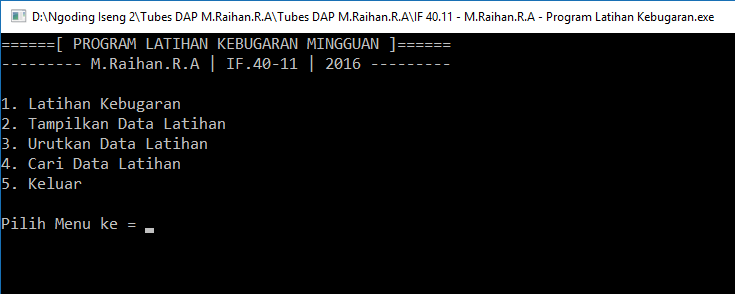
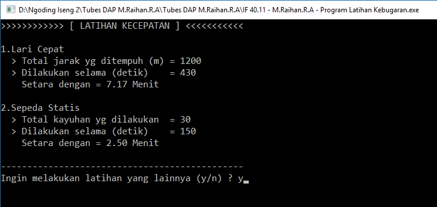
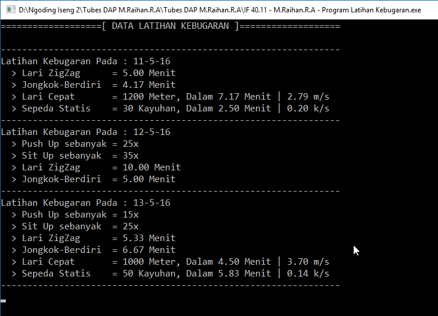
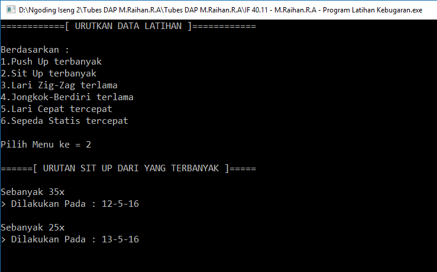
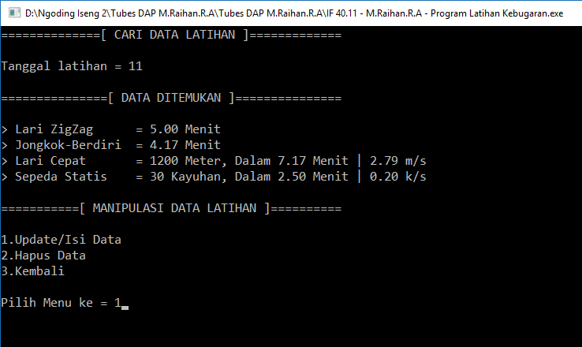
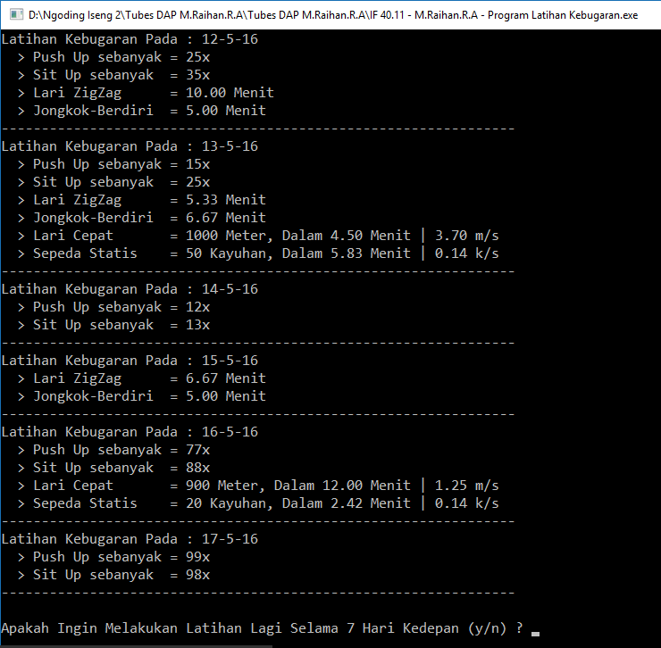

# Program Latihan Kebugaran

:one: Tentang
-------------
* Nama Aplikasi : Aplikasi Latihan Kebugaran Mingguan
* Mata Kuliah : Dasar Algoritma dan Pemrograman (DAP)
* Bahasa Pemrograman : PASCAL
* Software : Free Pascal
* Platform : Desktop
* Kontribusi Saya : Menyeluruh

:two: Deskripsi
---------------
Aplikasi ini bertujuan untuk memantau perkembangan latihan kebugaran harian user dalam rentang waktu 1 minggu. Macam latihan kebugaran dibatasi hanya tiga jenis kategori saja, yaitu kekuatan (strenght) yang meliputi push up dan sit up, kelincahan (agility) yang meliputi lari zigzag dan jongkok-berdiri, dan kecepetan (speed) yang meliputi lari cepat dan sepeda statis. Yang kemudian data latihan user dapat ditampilkan lagi untuk dipantau perkembangannya, atau bisa juga mengupdate dan menghapus data latihan user yang telah dilakukan sebelumnya (karena suatu alasan tertentu).

Kemudian apabila user telah melakukan latihan selama 1 minggu, maka Aplikasi akan memberikan user pertanyaan “Apakah anda ingin melakukan latihan lagi selama 1 minggu kedepan?” jika jawabannya “ya” maka user akan menginputkan lagi latihan selama 1 minggu dan data latihan minggu sebelumnya akan otomatis terhapus, jika jawabannya “tidak” maka aplikasi akan keluar dan selesai. 

Aplikasi ini hanya berfokus pada input, view, sort, search, update dan delete data latihan kebugaran saja, sehingga tidak mencakup jumlah rata-rata latihan yang dilakukan user pada masing-masing kategori.

:three: Fitur
-------------
- [x] **Insert** : User dapat menginputkan banyak jumlah latihan yang dilakukan, sesuai dengan kategori latihan yang dipilih. Dan user pun dapat pula memilih semua kategori latihan dalam hari yang sama sesuai keinginan user.

- [x] **View** : User dapat menampilkan seluruh data latihan yang pernah diinputkan user sebelumnya.

- [x] **Sorting** : User dapat mengurutkan data latihan yang pernah dilakukan berdasarkan: Push Up terbanyak, Sit Up terbanyak, Lari Zig-Zag terlama, Jongkok-Berdiri terlama, Lari Cepat tercepat, Sepeda Statis tercepat.

- [x] **Searching** : User dapat mencari data latihan yang pernah dilakukan berdasarkan tanggal latihan yang dilakukan. Dan kemudian menampilkan data latihan tersebut. Setelah itu user diberi pilihan apakah data tersebut akan di-update, di-delete atau hanya ditampilkan pada layar saja (tidak dimanipulasi).

- [x] **Update & Delete** : User dapat mengupdate/mendelete data latihan hari-hari sebelumnya yang dirasa salah menginputkan karena kelalaian user.

- [x] **Operasi File** : Aplikasi ini tidak dapat menyimpan data secara permanan (data akan hilang saat aplikasi di close), yang menyebabkan ketika aplikasi dibuka lagi, data-data latihan yang telah user inputkan sebelumnya akan hilang.

:four: Catatan
--------------
- User tidak boleh menginputkan tanggal yang sama, karena jelas dalam 1 minggu tanggal latihan pastilah berbeda-beda. Untuk bulan dan tahun, user diberi kebebasan untuk menginputkan, karena ini kondisional.
- Dalam input data Latihan Kelincahan dan Kecepatan, inputan waktu berupa detik dan ketika program menampilkan ulang data latihan yang telah diinput, detik akan otomatis dikonversi menjadi menit.
- Fitur Update bisa untuk mengupdate data latihan yang sebelumnya sudah ada (ditimpah) ataupun mengisi data latihan yang sebelumnya kosong, jadi ada jumlah latihannya.

:five: Screenshoot
------------------

